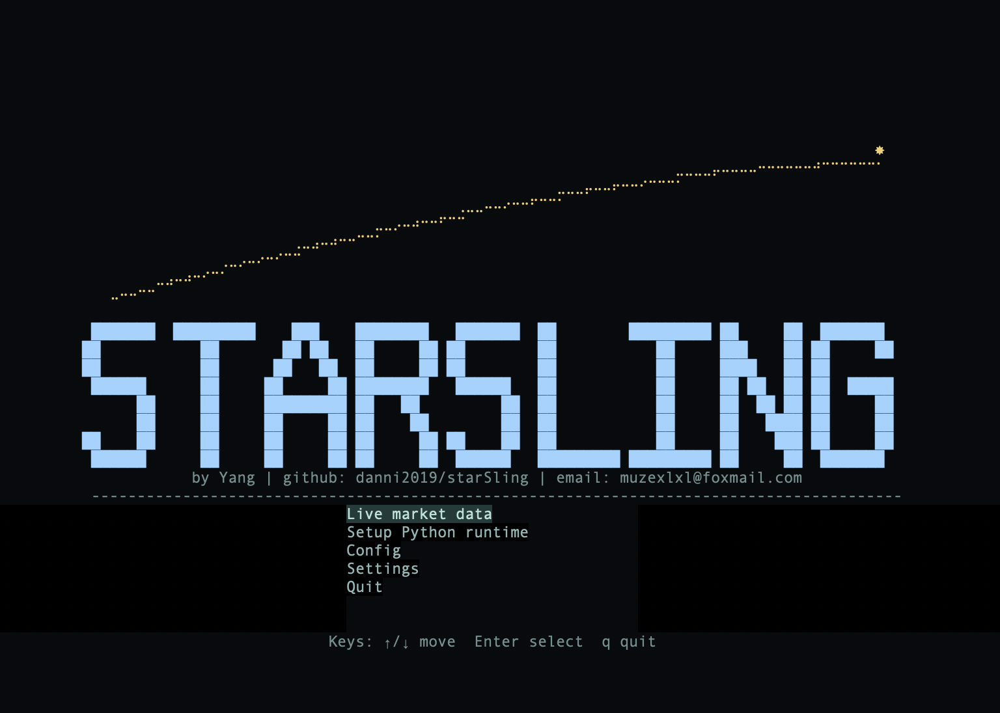
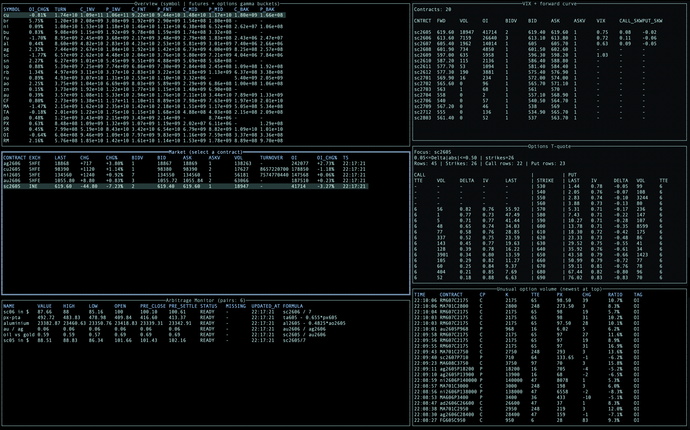

# starSling

`starSling` 是一个面向中国期货/期权市场的终端实时监控、实时分析与交易辅助项目。

当前公开仓库版本处于 `MVP / prerelease` 阶段，重点仍然是盘中实时能力：

- 实时行情接入与快照驱动展示
- 期权链、IV/Greeks、forward/VIX 观察
- 异常期权成交监控
- 多公式套利监控
- 本地配置、运行时引导与发布验证

历史落盘、回放回测和真实交易执行不是当前主线目标。

## 项目截图

主菜单：



Live 多面板界面：



## 当前界面结构

默认 Live 界面为六块主区域：

- 左上：`Overview (symbol)`，按 `symbol` 聚合展示期货热度与期权 `gamma inventory`
- 左中：`Market`，展示主行情表、选中合约与焦点联动
- 右上：`VIX + forward curve`
- 右中：`Options T-quote`
- 左下：`Arbitrage Monitor`
- 右下：`Unusual option volume`

其中左下当前默认展示套利监控；Go 端仍保留 `Flow Aggregation` 分析引擎，但公开版默认工作流已经以套利对管理与公式监控为主。

## 当前能力

### 实时行情与派生分析

- `live_md.py` 接入实时行情并推送 `market.snapshot`
- `options_worker.py` 基于最新市场快照计算期权链、IV/Greeks、forward 与 VIX/偏斜视图
- `unusual_worker.py` 基于成交额、持仓与帧间变化识别异常期权成交
- Go `router` 维护 latest-snapshot 状态，并为 UI / worker 提供本地 JSON-RPC 访问

### TUI 与交互

- symbol-level overview 单表
- 期货市场表排序、过滤、主力模式
- 期权链按焦点合约/标的联动
- Live 面板筛选、持久化与恢复
- 主菜单 `Config` / `Settings` / `Setup Python runtime`
- 未配置真实 `Host` / `Port` 时，UI 会阻止进入 `Live market data`

### 套利监控

- 支持多组套利对（pair）管理
- 支持完整算术表达式：`+ - * / ()`
- 支持常量、合约符号和带引号的特殊合约名
- 展示实时值、开盘值、最高/最低、昨收/昨结、缺失合约和状态

### 运行时与发布辅助

- `Setup Python runtime` 页面可在应用内引导首次 bootstrap
- `scripts/bootstrap_python.sh` 仍可作为手动 fallback
- `go run ./cmd/starsling doctor` 可执行发布/环境自检
- metadata 源配置、缓存目录与默认配置路径都已文档化
- `macOS` prerelease 已具备本地 `goreleaser` dry-run 验证路径

## 项目文档

- 公开路线图：[docs/project/roadmap.md](docs/project/roadmap.md)
- 公开仓库 / prerelease 门禁：[docs/release/public-readiness.md](docs/release/public-readiness.md)
- `macOS` prerelease 验证流程：[docs/release/macos-prerelease.md](docs/release/macos-prerelease.md)

## 快速开始

### 从 GitHub Release 运行

1. 从 GitHub Releases 下载对应平台的压缩包并解压
2. 在解压目录中运行：

```bash
./starsling
```

3. 如果本地 runtime 尚未初始化，应用会提示进入 `Setup Python runtime`
4. 完成 bootstrap 后，再在 `Config` 页面填写真实 `Host` / `Port`
5. 然后进入 `Live market data`

### 从源码本地运行

- Go `1.25+`
- Bash、curl、tar
- 可用的 OpenCTP 兼容环境或等效安装来源

### 本地运行

```bash
go build ./cmd/starsling
./starsling
```

或：

```bash
go run ./cmd/starsling
```

### 手动初始化 Python runtime（可选）

release 用户现在可以先运行 `./starsling`，再按应用内引导进入 `Setup Python runtime`。如果你更希望手动执行，也可以直接运行：

```bash
./scripts/bootstrap_python.sh
```

可选环境变量：

- `OPENCTP_WHEEL=/path/to/openctp.whl`
- `PIP_INDEX_URL=...`
- `PIP_EXTRA_INDEX_URL=...`
- `STARSLING_PYTHON_VERSION=3.11.x`

### 自检

```bash
go run ./cmd/starsling doctor
```

该命令会检查：

- 当前平台是否在 runtime 支持范围内
- `scripts/bootstrap_python.sh` 是否可定位
- `config/metadata.sources.json` 是否可定位
- 默认 `live-md.host` / `live-md.port` 是否仍为未配置状态
- 配置目录与 metadata 目录解析是否正常

### 首次进入 Live 前的配置要求

- 发布包与仓库默认配置中，`live-md.host` 为空，`live-md.port` 为 `0`
- 不预设任何 front 地址
- 如果 bundled runtime 尚未准备好，主界面和 `Live market data` 入口都会引导进入 `Setup Python runtime`
- 进入应用后，请先在 `Config` 页面填写真实可用的 `Host` 与 `Port`
- 未完成配置前，UI 不允许进入 `Live market data`

## 常用命令

```bash
go test ./...
go run ./cmd/starsling doctor
STARSLING_INTERNAL_DEBUG_UI=1 go run ./cmd/starsling
```

## 配置与数据目录

- 默认配置模板：`config/starsling.example.json`
- metadata 源：`config/metadata.sources.json`
- 用户配置目录：
  - macOS: `~/Library/Application Support/starsling/configs`
  - Linux: `${XDG_CONFIG_HOME:-~/.config}/starsling/configs`
- metadata / settings 目录：
  - macOS: `~/Library/Application Support/starsling/metadata`
  - Linux: `${XDG_CONFIG_HOME:-~/.config}/starsling/metadata`
- 本地 runtime：`runtime/<platform>/...`

## 当前发布状态

- 仓库已公开
- 当前发布目标优先为 `macOS prerelease`
- 当前用户路径已经收敛为：`下载 -> 解压 -> 运行 ./starsling -> 按应用内引导完成首次初始化`
- 本地已通过：
  - `goreleaser check`
  - `goreleaser release --snapshot --clean`
  - snapshot 归档解压后的 `./starsling doctor`
- prerelease 归档会包含：
  - 主程序
  - `LICENSE`
  - `README.md`
  - `CONTRIBUTING.md`
  - `SECURITY.md`
  - `config/starsling.example.json`
  - `config/metadata.sources.json`
  - `python/README.md`
  - `python/requirements.txt`
  - `scripts/bootstrap_python.sh`

当前 prerelease 不承诺把所有外部行情依赖一并打包完成；OpenCTP 兼容环境仍可能需要用户自行准备。

## 边界与非目标

- 暂未实现真实交易执行、报单回报、持仓管理
- 历史数据持久化、回放与回测不是当前主线
- 账户实时监控与风控仍在后续路线图中

## License

本项目代码采用 `BSD-3-Clause` 协议发布，详见 [LICENSE](LICENSE)。

第三方依赖、行情接入组件及数据服务仍分别受其各自许可证或服务条款约束。在生产、交易或商用场景中使用前，请自行确认相关授权边界。
